# Hotel_App

# Running the client

Install the dependencies in /src/frontend:

`npm install`

Run the project from the /src/frontend directory:

`npm run serve`

# Running the backend

Run the Java project (SpringVueApplication class) using the IDE of choice (for now).
You need to have MySQL server running, with the database name "hotel_db" using the database creation script provided in the files. 

# Usage

Open the url displayed after running the `npm run serve` command (typically `http://localhost:3000`).

## Client panel
The default view at `localhost:port` is the client panel.

## Admin panel
Go to `localhost:port/admin` to sign in. Default credentials: `login: admin` `password: admin`.
You will be directed to the main admin panel.

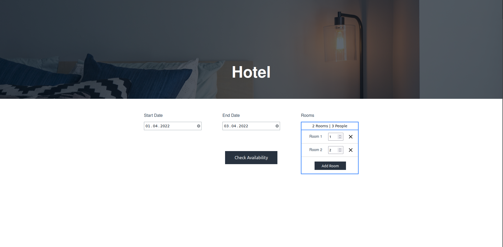
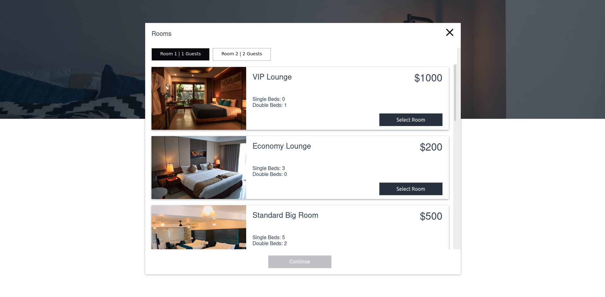
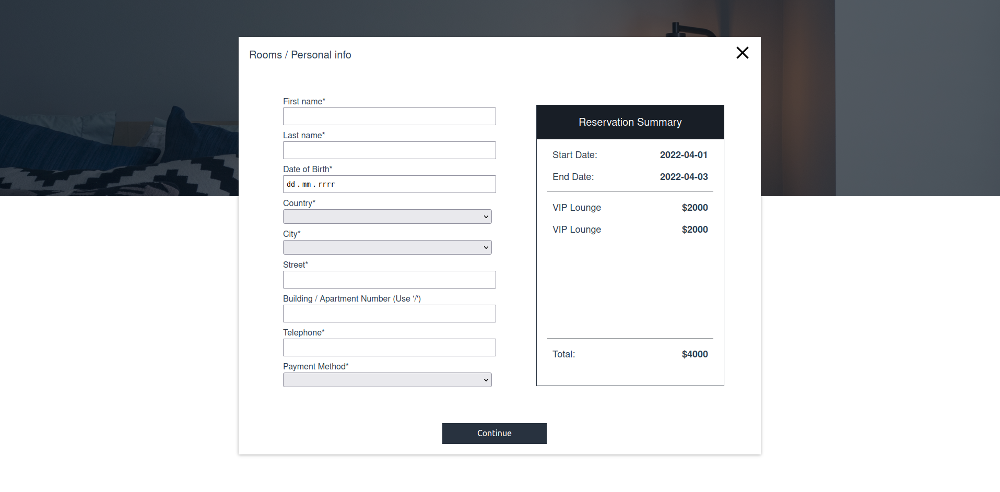
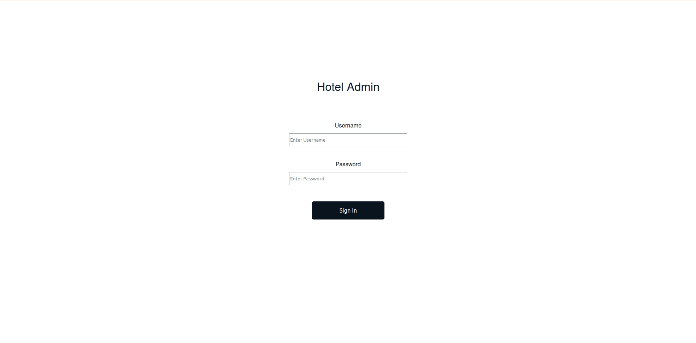
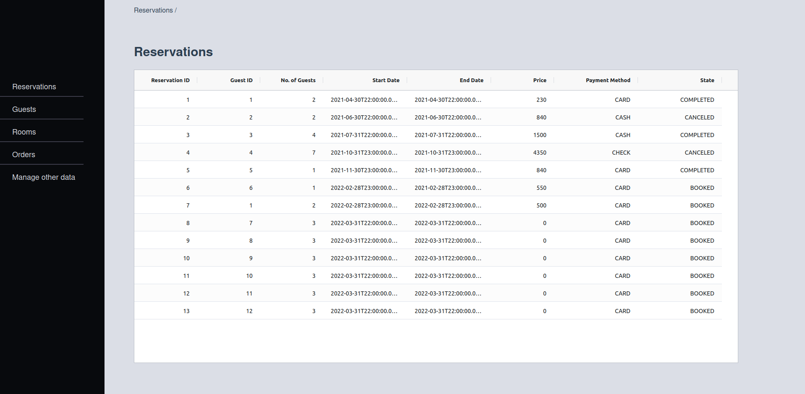
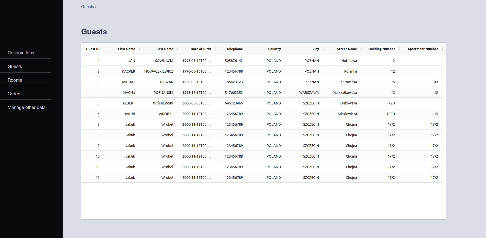
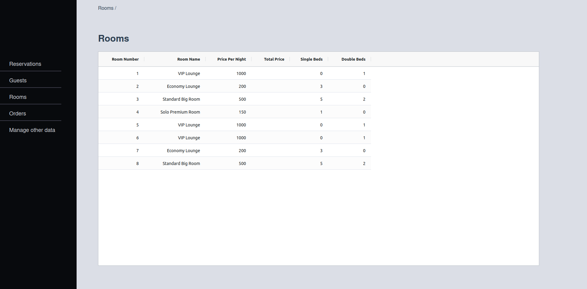
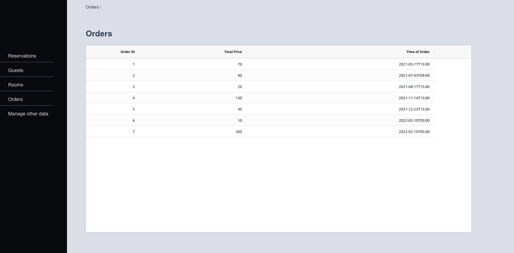
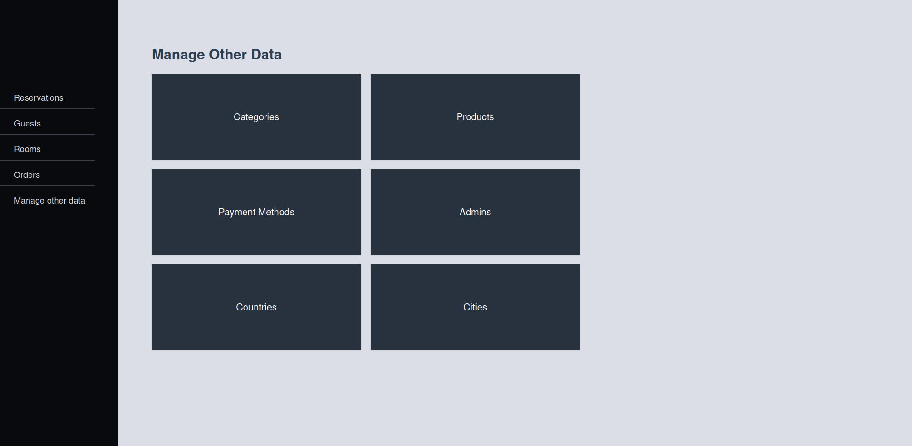
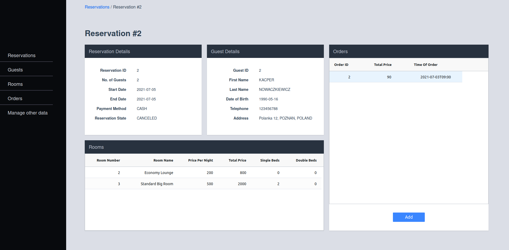

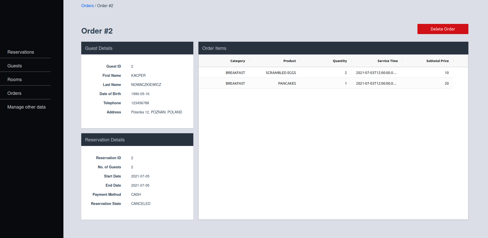
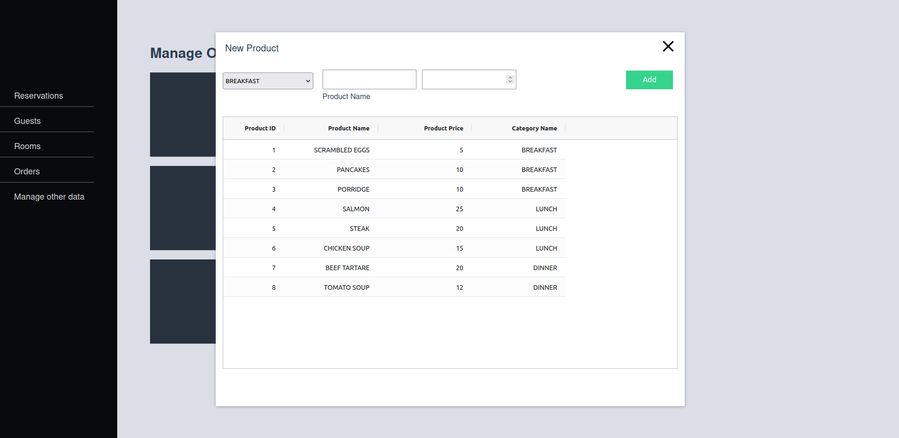

